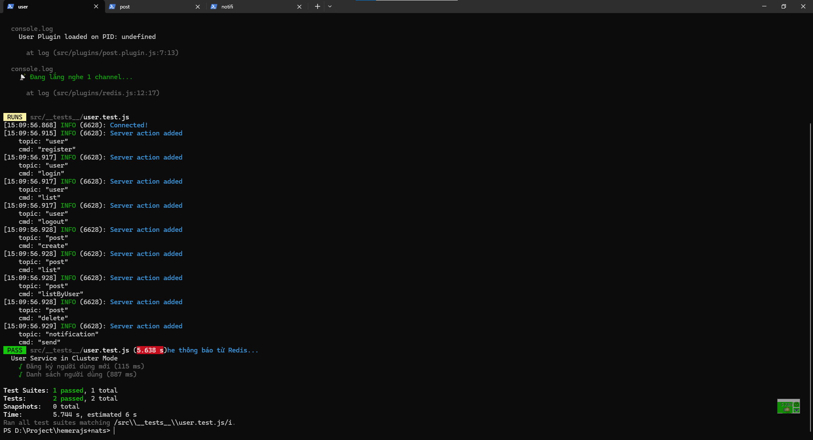
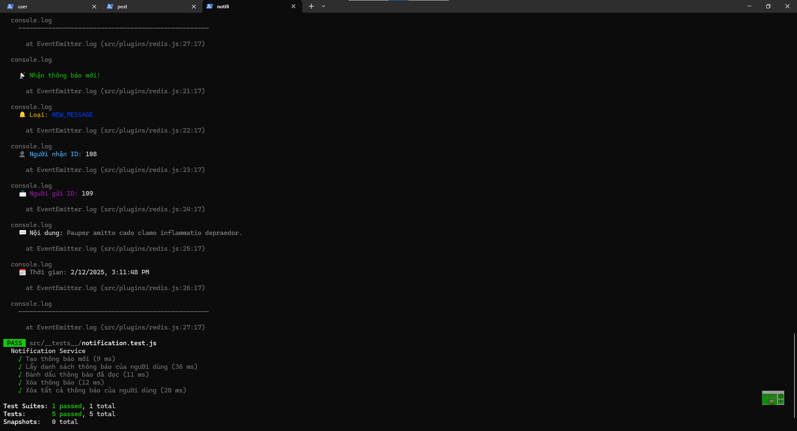

# **HEMERAJS + NATS**

## **DOCKER**

- `redis:6379`
- `nats-server:4222`

## **Test Case**
- Đổi encoding của terminal về UTF-8
`chcp 65001`
- Chạy server
`node src/server.js` hoặc `npm start`
```bash
npx jest
npx jest src/__tests__/user.test.js
npx jest src/__tests__/post.test.js
npx jest src/__tests__/notification.test.js
```


user test

post test

notification test

---

### **Cấu Trúc Thư Mục Dự Án**

```
/hemerajs-nats
│
├── /src
│   ├── /__tests__                  # Các file kiểm thử
│   │   ├── user.test.js            # Kiểm thử user
│   │   ├── post.test.js            # Kiểm thử post
│   │   ├── notification.test.js    # Kiểm thử notification
│   ├── /extensions                 # Mở rộng các tính năng
│   │   ├── user.extension.js       # User extension
│   │   ├── post.extension.js       # Post extension
│   ├── /plugins                    # Các plugin của hệ thống
│   │   ├── hemera.js               # Cấu hình Hemera
│   │   ├── prisma.js               # Cấu hình Prisma
│   │   ├── redis.js                # Cấu hình Redis
│   │   ├── user.plugin.js          # User plugin
│   │   ├── post.plugin.js          # Post plugin
│   │   ├── notification.plugin.js  # Notification plugin
│   ├── /schemas                    # Các schema cho các dịch vụ
│   │   ├── user.schemas.js         # Schema cho User
│   │   ├── post.schemas.js         # Schema cho Post
│   │   ├── notification.schemas.js # Schema cho Notification
│   ├── /services                   # Các service chính
│   │   ├── user.service.js         # Logic cho user
│   │   ├── post.service.js         # Logic cho post
│   │   ├── notification.service.js # Logic cho notification
│   ├── server.js                   # Cấu hình máy chủ và Hemera
├── /prisma                         # Các file của Prisma
│   ├── schema.prisma               # Cấu hình Prisma schema
│   ├── /migrations                 # Các migration của database
├── .env                            # Cấu hình biến môi trường
├── package.json                    # Các phụ thuộc của dự án
├── test.config.js                  # Cấu hình Jest 
└── README.md                       # Tài liệu dự án
```

---

### **Models**

#### `User`
- Người dùng có quan hệ 1-N với Post và Thông báo.

#### `Post`
- Quan hệ Post - User là 1-N: 1 người dùng có thể có nhiều bài đăng.

#### `Notification`
- Mỗi thông báo được liên kết với một người dùng và có thể có người gửi (senderId có thể là `null` nếu không có thông tin người gửi).
- Trường `createdAt` và `updatedAt` giúp theo dõi thời gian tạo và cập nhật của thông báo.

---

### **Extensions**

- **`onRequest`**: Middleware này ghi lại thông tin của yêu cầu (request) ngay khi nó đến, ghi lại `topic` và `cmd` của yêu cầu đó.
- **`onActFinished`**: Middleware này chạy sau khi hành động (action) hoàn thành, ghi lại thông báo hoàn thành với `topic` và `cmd`.
- **`onError`**: Middleware này bắt và ghi lại các lỗi xảy ra trong quá trình xử lý yêu cầu, trả lại lỗi cho client thông qua `reply(err)`.

---

### **NATS**

- Kết nối đến NATS.
- Khởi tạo Hemera kết nối tới NATS và cấu hình log.
- Export Hemera Instance sử dụng ở các module khác.

---

### **Redis**

- Khởi tạo 2 kết nối Redis: xuất bản (pub) và đăng ký (sub).
- Đăng ký kênh `notifications`.
- Xử lý sự kiện `message`: nhận thông điệp từ kênh và xử lý (in ra thông báo, gửi thông báo đến người dùng).

---

### **Prisma**

- Khởi tạo instance của `prismaClient` thông qua Prisma ORM để tương tác với cơ sở dữ liệu.

---

### **Plugins**

#### **User Plugin**:
1. Sử dụng `hemera-ajv` để xác thực dữ liệu.
2. **`register`**: Đăng ký user mới nếu dữ liệu hợp lệ.
3. **`login`**: Đăng nhập user.
4. **`delete`**: Xóa người dùng sau khi validate dữ liệu.

#### **Post Plugin**:
1. Sử dụng `hemera-ajv` để xác thực dữ liệu.
2. **`create`**: Tạo bài đăng mới.
3. **`list`**: Trả về danh sách bài đăng.
4. **`delete`**: Xóa bài đăng.

#### **Notification Plugin**:
1. **`redisSub.on('message')`**: Lắng nghe thông báo Redis.
2. **`parse` và `validate`**: Chuyển chuỗi JSON thành đối tượng JavaScript và kiểm tra hợp lệ theo schema.
3. **`hemera.act()`**: Gửi thông báo đến client.

---

### **Services**

#### `user.service.js`
- **`createdUser`**: Tạo mới user.
- **`listUsers`**: Lấy danh sách người dùng.
- **`deleteUser`**: Xóa người dùng.

#### `post.service.js`
- **`createdPost`**: Tạo bài đăng mới.
- **`listPosts`**: Lấy danh sách bài đăng.
- **`deletePost`**: Xóa bài đăng.

#### `notification.service.js`
- **`createNotification`**: Tạo mới thông báo và phát thông qua Redis.
- **`getUserNotification`**: Lấy danh sách thông báo của người dùng.
- **`markNotificationAsRead`**: Đánh dấu thông báo là đã đọc.

---

### **Test**

#### **user.test.js**
- **Tạo người dùng**: Kiểm tra chức năng tạo người dùng và xác minh mật khẩu đã băm đúng.
- **Liệt kê người dùng**: Kiểm tra chức năng liệt kê người dùng.
- **Xóa người dùng**: Kiểm tra chức năng xóa người dùng.
- **Dọn dẹp dữ liệu**: Xóa tất cả người dùng trước và sau mỗi bài kiểm tra.

#### **post.test.js**
- **Tạo bài đăng**: Kiểm tra chức năng tạo bài đăng với tiêu đề và nội dung đúng.
- **Liệt kê bài đăng**: Kiểm tra chức năng liệt kê các bài đăng của người dùng.
- **Xóa bài đăng**: Kiểm tra chức năng xóa bài đăng.
- **Dọn dẹp dữ liệu**: Xóa tất cả bài đăng và người dùng sau mỗi bài kiểm tra.

#### **notification.test.js**
- **Tạo thông báo**: Kiểm tra chức năng tạo thông báo.
- **Lấy danh sách thông báo**: Kiểm tra lấy danh sách thông báo của người dùng.
- **Đánh dấu thông báo là đã đọc**: Kiểm tra chức năng đánh dấu thông báo đã đọc.
- **Dọn dẹp dữ liệu**: Xóa tất cả thông báo và người dùng sau mỗi bài kiểm tra.

---

Cải tiến hiệu suất cho Hemerajs
1. Cluster (Tăng hiệu suất & khả năng mở rộng)
- Dùng cluster để tăng khả năng xử lý song song, giúp ứng dụng tận dụng nhiều CPU.
- Giúp tăng tốc độ xử lý & chịu tải.
2. Redis (Caching & Pub/Sub)
- Cải tiến hiệu suất: dùng Redis làm cache: lưu kết quả query để truy xuất nhanh hơn.
- Dùng Redis Pub/Sub để xử lý sự kiện (event-driven) (gửi thông báo, xử lý hàng đợi công việc).
3. Prisma (ORM & Database)
- Dùng Prisma để kết nối DB.

Công nghệ       Có phải chức năng mới không?	      Lý do
Cluster	        ❌ Không	                            Cải tiến hiệu suất, không thay đổi nghiệp vụ
Redis Cache	    ❌ Không	                            Truy vấn nhanh hơn
Redis Pub/Sub	✅ Có	                            Thêm cách xử lý sự kiện, có thể thay đổi luồng nghiệp vụ
Prisma ORM	    ❌ Không	                            Truy cập DB, không thay đổi logic


Khi nào nên dùng Redis Pub/Sub thay vì Hemera Pub/Sub?
Tiêu chí	                    Redis Pub/Sub	                                              Hemera Pub/Sub
Xử lý thông báo (Notifications)	✅ Tốt hơn, hỗ trợ lưu trữ nếu cần	                        🚫 Không lưu tin nhắn
Hàng đợi công việc (Job Queue)	✅ Kết hợp Redis Streams/BullMQ để xử lý hàng đợi	        🚫 Không có cơ chế quản lý hàng đợi
Mở rộng hệ thống	            ✅ Hoạt động tốt trong hệ thống lớn, hỗ trợ clustering	    🚫 Phụ thuộc vào NATS, khó mở rộng nếu NATS bị quá tải
Tích hợp với hệ thống khác	    ✅ Không phụ thuộc vào NATS, dễ tích hợp	                    🚫 Chỉ hoạt động trong môi trường Hemera/NATS

`Ưu điểm của Redis Pub/Sub so với Hemera Pub/Sub`:

1. Hỗ trợ đa nền tảng, không phụ thuộc vào NATS
Redis có thể được sử dụng cho nhiều ứng dụng khác nhau mà không cần phụ thuộc vào NATS.
Trong khi đó, Hemera Pub/Sub chỉ hoạt động trong phạm vi NATS, nếu hệ thống của bạn mở rộng với nhiều thành phần khác không sử dụng NATS, Redis sẽ linh hoạt hơn.

2. Giảm tải cho NATS
Redis giúp giảm tải cho NATS bằng cách tách biệt luồng giao tiếp nội bộ của Hemera (RPC, request-response) với các sự kiện không cần phản hồi ngay lập tức.
Điều này giúp NATS tập trung vào việc truyền thông tin quan trọng giữa các microservices mà không bị quá tải bởi các sự kiện thông báo hay hàng đợi công việc.

3. Khả năng mở rộng cao hơn
Redis Pub/Sub có thể mở rộng theo mô hình Cluster, hỗ trợ phân tán dữ liệu giúp hiệu suất tốt hơn.
Hemera Pub/Sub phụ thuộc vào kiến trúc của NATS, và nếu NATS gặp bottleneck, hiệu suất có thể giảm.

4. Lưu trữ tin nhắn trong hàng đợi (Redis Streams hoặc List)
Redis có thể kết hợp Redis Streams hoặc Redis Lists để lưu tin nhắn, giúp đảm bảo message không bị mất khi subscriber bị gián đoạn.
Hemera Pub/Sub không có cơ chế lưu trữ tin nhắn, nếu subscriber chưa lắng nghe tại thời điểm gửi, tin nhắn sẽ mất.